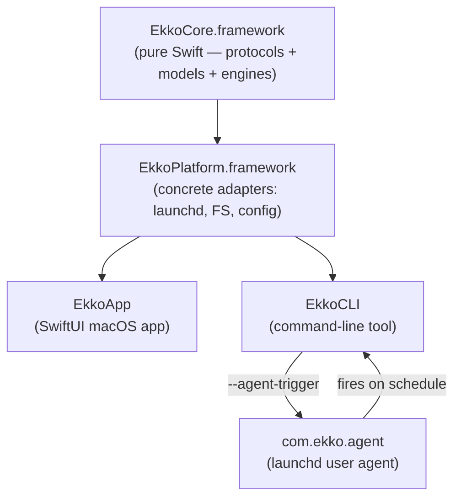

# M0 — Architecture & Foundation Design

**Spec**: `.specs/features/m0-foundation/spec.md`
**Status**: Draft

---

## Architecture Overview

**SPM + Xcode hybrid.** `EkkoCore`, `EkkoPlatform`, and `EkkoCLI` are Swift Package Manager targets defined in `Package.swift` (fully automatable, `swift test` works without Xcode). `EkkoApp` is an Xcode project (required for macOS app bundle, code signing, and notarization) that references the local SPM package. The CLI binary is bundled inside the app and symlinked to `/usr/local/bin/ekko` by the in-app installer.



---

## Directory Structure

```
ekko-app/
├── Package.swift                      ← SPM: EkkoCore, EkkoPlatform, EkkoCLI targets
│
├── Sources/
│   ├── EkkoCore/                      ← SPM library target
│   │   ├── Protocols/
│   │   │   ├── FileSystemProvider.swift
│   │   │   ├── ConfigStore.swift
│   │   │   └── SchedulerProvider.swift
│   │   ├── FeatureFlags/
│   │   │   ├── Feature.swift
│   │   │   ├── FeatureFlagProvider.swift
│   │   │   └── FeatureFlags.swift
│   │   ├── Logging/
│   │   │   ├── EkkoLogger.swift
│   │   │   └── LogEntry.swift
│   │   ├── Models/
│   │   │   ├── BackupSchedule.swift
│   │   │   ├── SchedulerStatus.swift
│   │   │   └── FileAttributes.swift
│   │   └── Version.swift
│   │
│   ├── EkkoPlatform/                  ← SPM library target
│   │   ├── FileSystem/
│   │   │   └── DirectFileSystemProvider.swift
│   │   ├── Config/
│   │   │   └── LocalConfigStore.swift
│   │   ├── Scheduler/
│   │   │   └── LaunchdScheduler.swift
│   │   ├── CLI/
│   │   │   └── CLIInstaller.swift
│   │   ├── FeatureFlags/
│   │   │   └── DefaultFeatureFlagProvider.swift
│   │   └── Resources/
│   │       └── com.ekko.agent.plist   ← launchd template (copied by build phase)
│   │
│   └── EkkoCLI/                       ← SPM executable target
│       ├── main.swift
│       └── Commands/
│           ├── RootCommand.swift
│           └── AgentTriggerCommand.swift
│
├── Tests/
│   ├── EkkoCoreTests/
│   └── EkkoPlatformTests/
│
└── EkkoApp/                           ← Xcode project (created once via Xcode GUI)
    ├── EkkoApp.xcodeproj
    └── Sources/
        ├── EkkoAppApp.swift           ← @main
        ├── AppDelegate.swift
        ├── ContentView.swift          ← placeholder shell
        └── Resources/
            └── Localizable.xcstrings
```

---

## Code Reuse Analysis

Greenfield project — no existing code. All components are new.

### Integration Points

| System | Method |
|---|---|
| macOS `launchd` | `launchctl bootstrap` / `bootout` / `print` via `Process` |
| macOS filesystem | `FileManager` (wrapped behind `FileSystemProvider`) |
| macOS `os_log` | Used directly inside `EkkoLogger` for `.error` level only |
| `/usr/local/bin` | Symlink created by `CLIInstaller` via `FileManager.createSymbolicLink` |

---

## Components

### `FileSystemProvider` (EkkoCore — Protocol)

- **Purpose:** Abstracts all filesystem I/O so EkkoCore never calls FileManager directly.
- **Location:** `EkkoCore/Sources/Protocols/FileSystemProvider.swift`
- **Interface:**
```swift
public protocol FileSystemProvider {
    func copy(from source: URL, to destination: URL) async throws
    func contents(ofDirectory url: URL) async throws -> [URL]
    func attributes(ofItem url: URL) async throws -> FileAttributes
    func createDirectory(at url: URL) async throws
    func removeItem(at url: URL) async throws
    func fileExists(at url: URL) -> Bool
}
```

---

### `ConfigStore` (EkkoCore — Protocol)

- **Purpose:** Typed key-value persistence for app configuration. Hides where data is stored (plain file today, App Group container later).
- **Location:** `EkkoCore/Sources/Protocols/ConfigStore.swift`
- **Interface:**
```swift
public protocol ConfigStore {
    func load<T: Codable>(_ type: T.Type, forKey key: String) throws -> T?
    func save<T: Codable>(_ value: T, forKey key: String) throws
    func delete(forKey key: String) throws
}
```

---

### `SchedulerProvider` (EkkoCore — Protocol)

- **Purpose:** Abstracts the scheduling backend (launchd today, SMAppService if sandboxed later).
- **Location:** `EkkoCore/Sources/Protocols/SchedulerProvider.swift`
- **Interface:**
```swift
public protocol SchedulerProvider {
    func register(schedule: BackupSchedule) throws
    func unregister() throws
    func status() throws -> SchedulerStatus
}
```

---

### `DirectFileSystemProvider` (EkkoPlatform — Concrete)

- **Purpose:** `FileSystemProvider` implementation using `Foundation.FileManager`. Not sandboxed — has full access to user-selected paths.
- **Location:** `EkkoPlatform/Sources/FileSystem/DirectFileSystemProvider.swift`
- **Dependencies:** `Foundation`, `EkkoCore`

---

### `LocalConfigStore` (EkkoPlatform — Concrete)

- **Purpose:** `ConfigStore` backed by JSON files in `~/Library/Application Support/Ekko/`.
- **Location:** `EkkoPlatform/Sources/Config/LocalConfigStore.swift`
- **Storage path:** `FileManager.default.urls(for: .applicationSupportDirectory)[0]/Ekko/`
- **Dependencies:** `Foundation`, `EkkoCore`
- **Note:** Each key maps to a separate `<key>.json` file. No single monolithic config blob — easier to extend and diff.

---

### `LaunchdScheduler` (EkkoPlatform — Concrete)

- **Purpose:** `SchedulerProvider` implementation via launchd user agent.
- **Location:** `EkkoPlatform/Sources/Scheduler/LaunchdScheduler.swift`
- **Dependencies:** `Foundation`, `EkkoCore`
- **Behaviour:**
  1. Reads plist template from bundle resources (`com.ekko.agent.plist`)
  2. Injects runtime values: CLI path (`Bundle.main` resolved to `Contents/MacOS/EkkoCLI`), schedule interval
  3. Writes rendered plist to `~/Library/LaunchAgents/com.ekko.agent.plist`
  4. Calls `launchctl bootstrap gui/<uid> <plist-path>` via `Process`
  5. `status()` parses `launchctl print gui/<uid>/com.ekko.agent` output
- **Interface addition:**
```swift
public struct LaunchdScheduler: SchedulerProvider {
    public func register(schedule: BackupSchedule) throws
    public func unregister() throws               // launchctl bootout
    public func status() throws -> SchedulerStatus
}
```

---

### `CLIInstaller` (EkkoPlatform)

- **Purpose:** Creates/removes the `/usr/local/bin/ekko` symlink pointing to the bundled CLI.
- **Location:** `EkkoPlatform/Sources/CLI/CLIInstaller.swift`
- **Interface:**
```swift
public struct CLIInstaller {
    public static var cliURL: URL        // path to EkkoCLI inside the app bundle
    public static var isInstalled: Bool  // checks symlink existence + validity
    public static func install() throws  // creates /usr/local/bin/ekko symlink
    public static func uninstall() throws
}
```
- **Install path:** `/usr/local/bin/ekko → <AppBundle>/Contents/MacOS/EkkoCLI`
- **Note:** Creates `/usr/local/bin/` if missing. Overwrites stale symlink silently.

---

### `FeatureFlags` (EkkoCore)

- **Purpose:** Centralized runtime gate for all major capabilities.
- **Location:** `EkkoCore/Sources/FeatureFlags/`
- **Interface:**
```swift
public enum Feature: String, CaseIterable {
    case scheduling
    case encryption
    case restore
    case cliInstaller
    case logRetention
    case backupRetention
}

public protocol FeatureFlagProvider {
    func isEnabled(_ feature: Feature) -> Bool
}

public final class FeatureFlags {
    public static var provider: FeatureFlagProvider = DefaultFeatureFlagProvider()
    public static func isEnabled(_ feature: Feature) -> Bool {
        provider.isEnabled(feature)
    }
}
```
- **`DefaultFeatureFlagProvider`:** All flags enabled by default for v1. Swap in `TestFeatureFlagProvider` in tests.

---

### `EkkoLogger` (EkkoCore)

- **Purpose:** Structured log writer consumed by both app and CLI.
- **Location:** `EkkoCore/Sources/Logging/EkkoLogger.swift`
- **Interface:**
```swift
public struct EkkoLogger {
    public static func log(
        _ message: String,
        level: LogLevel,
        category: String,
        file: String = #file,
        line: Int = #line
    )
}

public enum LogLevel: String, Codable { case debug, info, warning, error }
```
- **Output:** JSON lines written to `~/Library/Logs/Ekko/ekko.log`
- **`os_log`:** Emitted in addition for `.error` level (visible in Console.app)
- **Retention:** Prunes entries older than configured days on each write (default: 7 days)
- **`EkkoLogger` receives its write path via `ConfigStore`** — injected at app startup, not hardcoded

---

### `Version` (EkkoCore)

- **Location:** `EkkoCore/Sources/Version.swift`
```swift
public enum EkkoVersion {
    public static let current = "0.1.0"
    public static let build   = "1"
}
```
Both `EkkoApp` and `EkkoCLI` read from this single source of truth.

---

## Data Models

### `BackupSchedule`

```swift
public struct BackupSchedule: Codable, Equatable {
    public let interval: Interval

    public enum Interval: Codable, Equatable {
        case hourly
        case daily(hour: Int, minute: Int)
        case weekly(weekday: Int, hour: Int, minute: Int)
    }
}
```

### `SchedulerStatus`

```swift
public enum SchedulerStatus: Equatable {
    case active(nextFireDate: Date?)
    case inactive
    case error(String)
}
```

### `FileAttributes`

```swift
public struct FileAttributes {
    public let size: Int64
    public let modificationDate: Date
    public let isDirectory: Bool
}
```

### `LogEntry`

```swift
public struct LogEntry: Codable {
    public let id: UUID
    public let timestamp: Date
    public let level: LogLevel
    public let category: String
    public let message: String
}
```

---

## launchd Plist Schema

Template stored in `EkkoPlatform/Sources/Resources/com.ekko.agent.plist`.
`LaunchdScheduler` fills in `__CLI_PATH__` and `__SCHEDULE__` at registration time.

```xml
<?xml version="1.0" encoding="UTF-8"?>
<!DOCTYPE plist PUBLIC "-//Apple//DTD PLIST 1.0//EN"
    "http://www.apple.com/DTDs/PropertyList-1.0.dtd">
<plist version="1.0">
<dict>
    <key>Label</key>
    <string>com.ekko.agent</string>

    <key>ProgramArguments</key>
    <array>
        <string>__CLI_PATH__</string>
        <string>--agent-trigger</string>
    </array>

    <!-- __SCHEDULE__ is replaced with StartCalendarInterval dict by LaunchdScheduler -->
    <key>StartCalendarInterval</key>
    __SCHEDULE__

    <key>RunAtLoad</key>
    <false/>

    <key>StandardOutPath</key>
    <string>__LOG_DIR__/agent.log</string>

    <key>StandardErrorPath</key>
    <string>__LOG_DIR__/agent-error.log</string>

    <key>KeepAlive</key>
    <false/>
</dict>
</plist>
```

`LaunchdScheduler` uses string replacement (not XML parsing) for the template tokens — simple and dependency-free.

---

## Error Handling Strategy

| Scenario | Handling | User Impact |
|---|---|---|
| `launchctl bootstrap` fails — agent already loaded | Detect exit code 0 from `launchctl print`; treat as success | None |
| `launchctl bootstrap` fails — permission denied | Throw `SchedulerError.permissionDenied`; surface in UI settings | Settings shows agent status as "Error — check permissions" |
| `/usr/local/bin` does not exist | `CLIInstaller.install()` creates it via `FileManager` before symlinking | None |
| Log directory does not exist | `EkkoLogger` creates `~/Library/Logs/Ekko/` on first write | None |
| Config key not found | `ConfigStore.load` returns `nil` (not a throw) — callers use default values | None |
| App Support directory not writable | `LocalConfigStore` throws `ConfigError.storageUnavailable` | Alert in app on first launch |

---

## Tech Decisions

| Decision | Choice | Rationale |
|---|---|---|
| Bundle identifier | `io.ekko.app` | Product-oriented; launchd agent label: `io.ekko.agent` |
| Core/Platform/CLI target type | SPM (not Xcode `.framework`) | Fully automatable; `swift test` works without Xcode; CI runs without GUI; EkkoApp references local package |
| CLI argument parsing | `swift-argument-parser` (Apple OSS, SPM) | Declarative, robust, scales to all M1+ subcommands; only dependency, scoped to EkkoCLI target |
| Test framework | Swift Testing (`#expect`, `#require`) | Project is greenfield on Xcode 16; no legacy migration cost |
| Config storage | One JSON file per key in App Support | Avoids monolithic config lock; keys can evolve independently |
| launchd plist injection | String token replacement | Zero dependencies; plist structure is fixed, only values change |
| CLI path in plist | Resolved at registration time from `Bundle.main` | Survives app moves (reinstall regenerates plist) |
| FeatureFlags default | All flags ON | v1 is for personal use; flags exist for future gating, not current restriction |
| Log format | JSON lines (one JSON object per line) | Machine-parseable by CLI `--json` flag; human-readable with `jq` |
| `EkkoLogger` path injection | Via `ConfigStore` | Keeps Core free of hardcoded paths; testable with in-memory store |

## Bundle Identifiers

| Target | Bundle ID |
|---|---|
| EkkoApp | `io.ekko.app` |
| EkkoCLI | `io.ekko.cli` |
| EkkoCore | `io.ekko.core` |
| EkkoPlatform | `io.ekko.platform` |
| launchd agent | `io.ekko.agent` |
